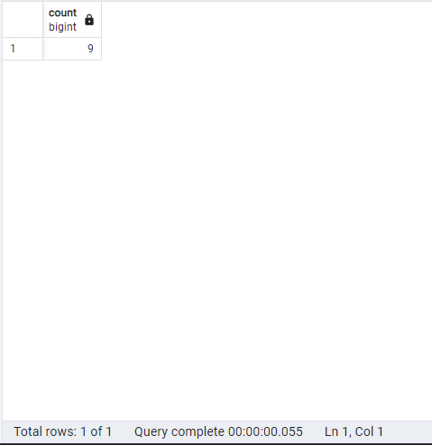

## 1. Retrieve distinct values from the replacement_cost column in the film table.

### Query:
```sql
SELECT DISTINCT replacement_cost FROM film;
````

### Explanation:
This query retrieves the distinct values from the replacement_cost column in the film table, listing the unique values.

### Result:
 

## 2. Retrieve the number of distinct values in the replacement_cost column in the film table.
### Query:
```sql
SELECT COUNT(DISTINCT replacement_cost) FROM film;
````
### Explanation:
This query counts how many unique values exist in the replacement_cost column in the film table.

### Result:
 
 
## 3. Retrieve the number of film titles that start with the letter 'T' and have a rating of 'G'.
### Query:
```sql
SELECT COUNT(*) FROM film
WHERE title LIKE 'T%' AND rating = 'G';
````
### Explanation:
This query counts how many films have titles starting with the letter 'T' and a rating of 'G' in the film table.
### Result:
 
 
## 4. Retrieve the number of country names with exactly 5 characters in the country table.
### Query:
````sql
SELECT COUNT(*) FROM country
WHERE LENGTH(country) = 5;
````
### Explanation:
This query counts how many countries have names that are exactly 5 characters long in the country table.

### Result:
 
 
## 5. Retrieve the number of city names that end with the letter 'R' or 'r' in the city table.
### Query:
```sql
SELECT COUNT(*) FROM city
WHERE city LIKE '%R' OR city LIKE '%r';
````
### Explanation:
This query counts how many city names end with the letter 'R' or 'r' in the city table.

### Result:
 
 
